# Windows 11 UI Inconsistencies
The purpose of this project is to list and rank the various inconsistencies across the Windows 11 UI, documenting the improvements as Microsoft cleans up old UI across Windows versions while prioritizing the more relevant ones.

| Surface & issue | Type | 21H2 | Screenshot | GH Issue |
|-|-|-|-|-|
| **Add device wizard** | Sys UI | ❌ Broken on 22000.194 | 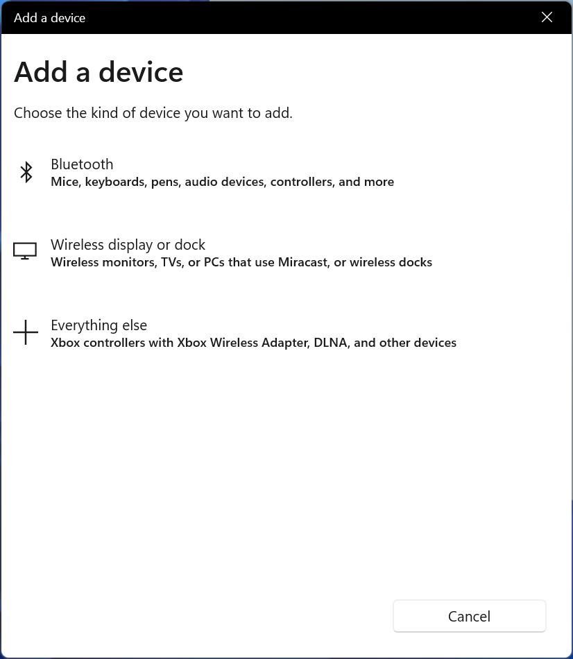 | TK |
| **Character Map** | Executable | ❌ Broken on 22000.194 | 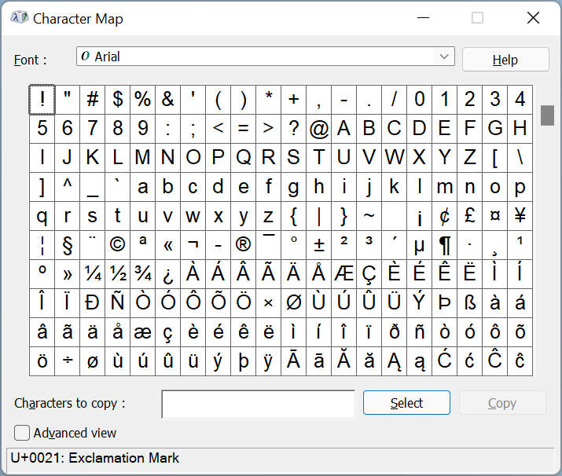 | TK |
| **Control Panel** | Sys UI | ❌ Broken on 22000.194 | 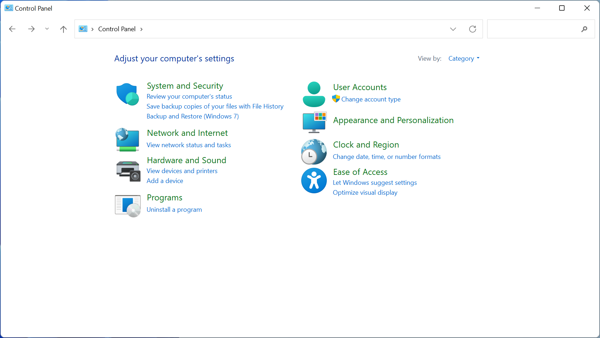 | TK |
| **Folder options**  | Sys UI | ❌ Broken on 22000.194 | 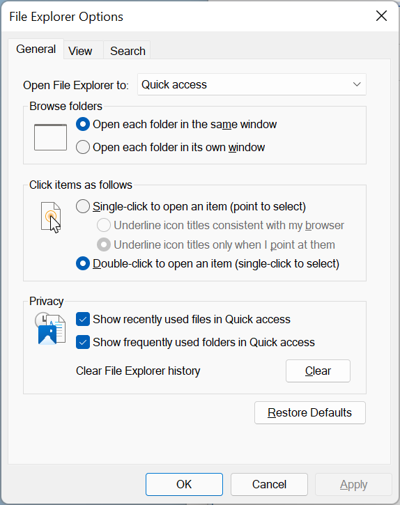 | TK |
| **Folder properties**  | Sys UI | ❌ Broken on 22000.194 | 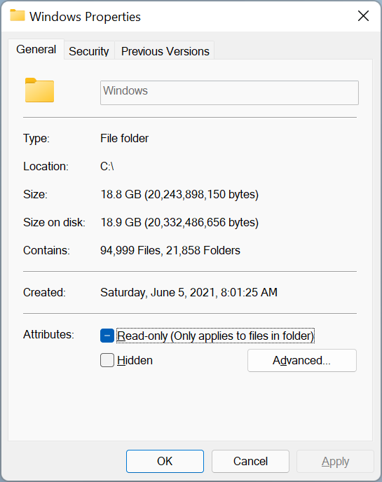 | TK |
| **Map Network Drive wizard** | Sys UI | ❌ Broken on 22000.194 | 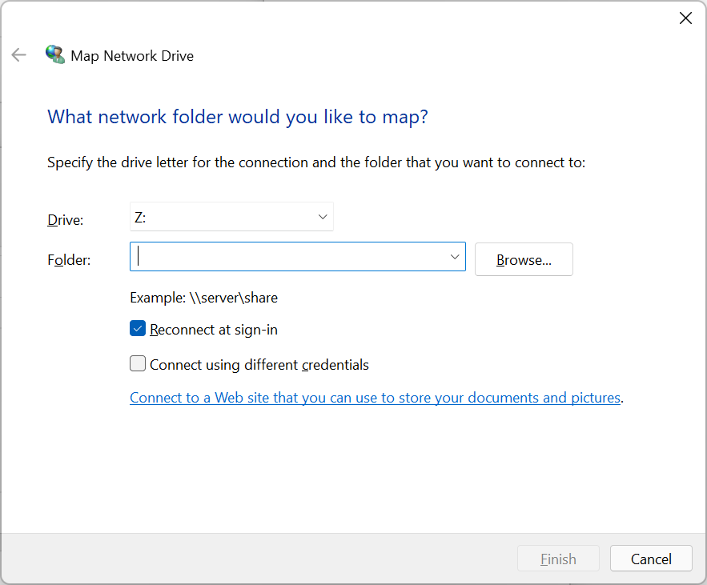 | TK |
| **Mouse options**  | Sys UI | ❌ Broken on 22000.194 | 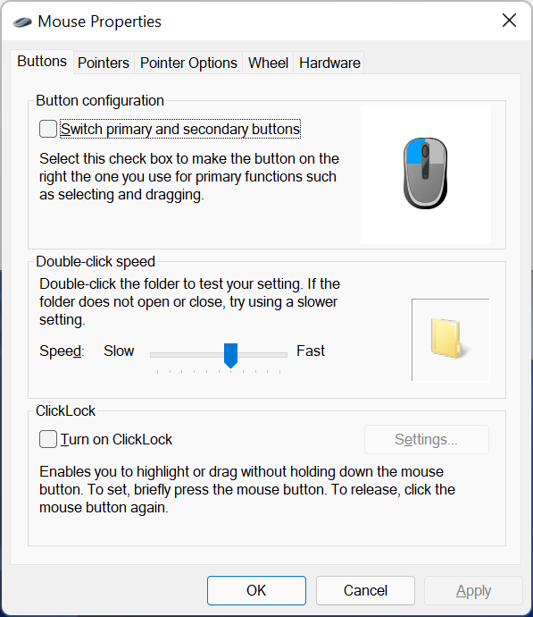 | TK |
| **ODBC settings panel**  Blurry fonts | Settings app  | ❌ Broken on 22000.194 | 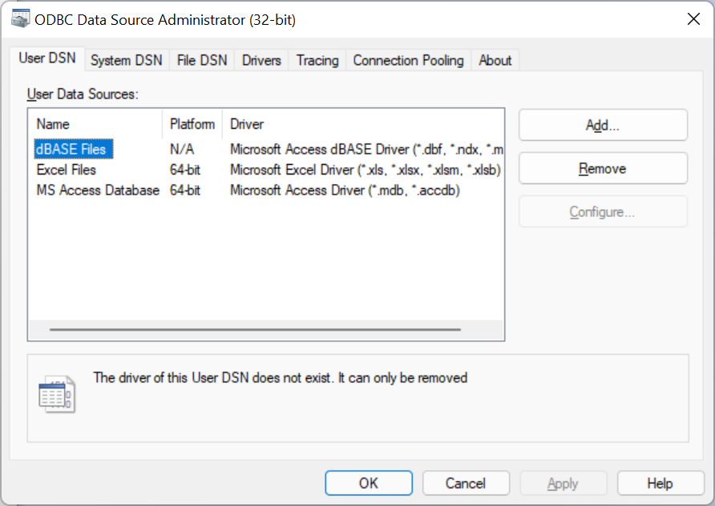 | TK |
| **Registry Editor**  | Executable | ❌ Broken on 22000.194 | 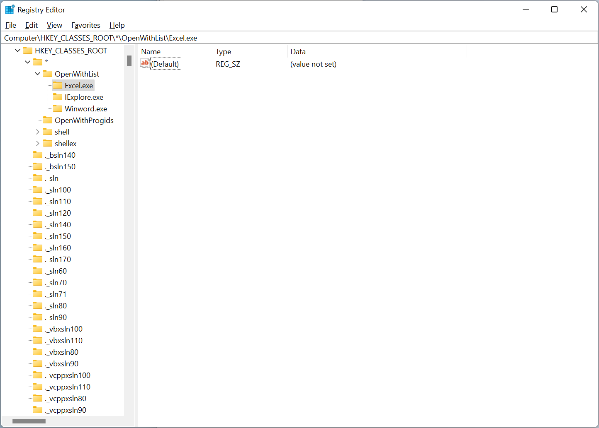 | TK |
| **Recycle Bin options**  | Sys UI | ❌ Broken on 22000.194 | 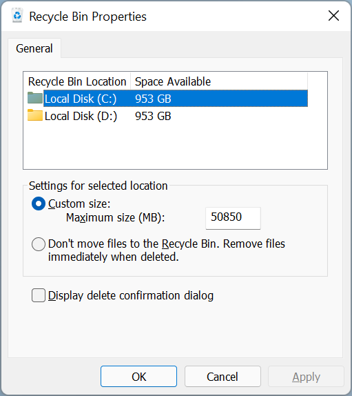 | TK |
| **Run dialog**  | Sys UI | ❌ Broken on 22000.194 | 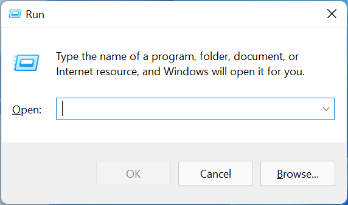 | TK |
| **System Properties**  Includes settings for hostname, workgroup/AD, eye candy performance, user profiles, boot settings, env vars, system protection/restore, and remote assistance/desktop connection | Sys UI | ❌ Broken on 22000.194 | 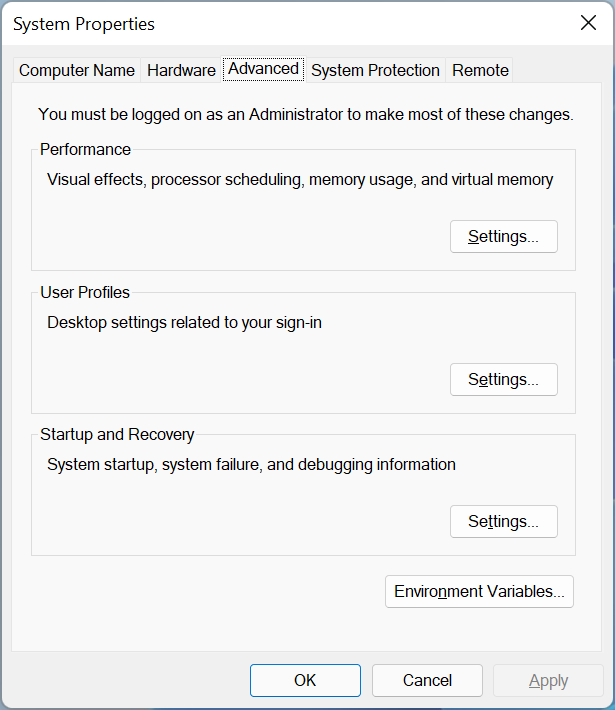 | TK |